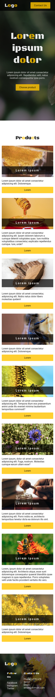

# Solution to Codecademy Challenge Project "Company Home Page with Flexbox"

This is a solution to the [Codecademy](https://www.codecademy.com). Codecademy Challenge Project "Company Home Page with Flexbox".

## Table of contents

- [Overview](#overview)
  - [The challenge](#the-challenge)
  - [Screenshot](#screenshot)
  - [Links](#links)
- [My process](#my-process)
  - [Built with](#built-with)
- [Author](#author)

## Overview

### The challenge

- Build out company home page by using Flexbox. Instead of a step-by-step tutorial, this project contains a series of open-ended requirements which describe the project

### Screenshot

- Mobile preview 375x812:

- Desktop preview 1908x1000:

### Links

- Solution URL: [Github Repo](https://github.com/nerijus-bauza/codecademy-projects-business-site)
- Live Site URL: [Github pages](https://nerijus-bauza.github.io/codecademy-projects-business-site/)

## My process

### Built with

- Semantic HTML5 markup
- CSS custom properties
- Flexbox
- Mobile-first workflow

## Author

- Github - [nerijus-bauza](https://github.com/nerijus-bauza)
