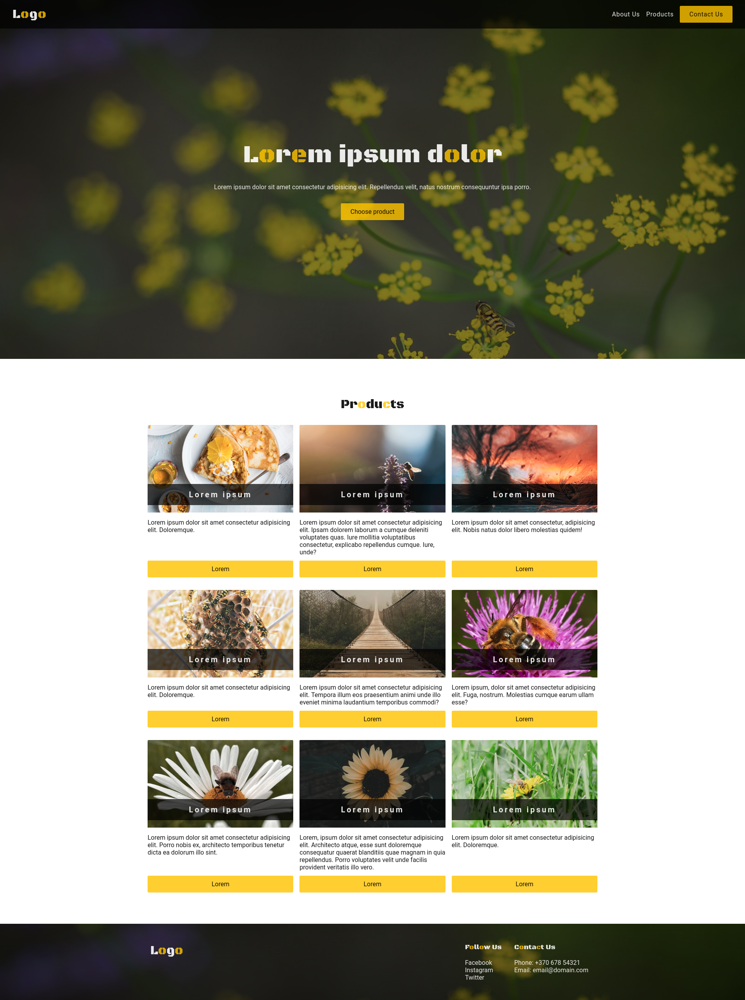

# Solution to Codecademy Challenge Project "Company Home Page with Flexbox"

This is a solution to the [Codecademy](https://www.codecademy.com) Challenge Project "Company Home Page with Flexbox".
It is a open-ended challenge, so the project is done from scratch. I used lorem generator for text and unsplash for images.

## Table of contents

- [Overview](#overview)
  - [The challenge](#the-challenge)
  - [Screenshot](#screenshot)
  - [Links](#links)
- [My process](#my-process)
  - [Built with](#built-with)
  - [What I learned](#what-i-learned)
- [Author](#author)

## Overview

### The challenge

- Build out company home page by using Flexbox. Instead of a step-by-step tutorial, this project contains a series of open-ended requirements which describe the project

### Screenshot

- Mobile preview 375x812:


- Desktop preview 1908x1000:



### Links

- Solution URL: [Github Repo](https://github.com/nerijus-bauza/codecademy-projects-business-site)
- Live Site URL: [Github pages](https://nerijus-bauza.github.io/codecademy-projects-business-site/)

## My process

### Built with

- Semantic HTML5 markup
- CSS custom properties
- Flexbox
- Mobile-first workflow

### What I learned

- I learned how to use unsplash to generate random thematic images.
- How to overlay background image by using linear-gradient
- How to set background image as variable

```css
:root {
  --bg-image-cta-url: url('https://source.unsplash.com/1600x900/?nature,bees');
}
.cta {
  background:
    linear-gradient(rgba(0,0,0,0.5),rgba(0,0,0,0.5)),
    var(--bg-image-cta-url) no-repeat;
}
```

## Author

- Github - [nerijus-bauza](https://github.com/nerijus-bauza)
